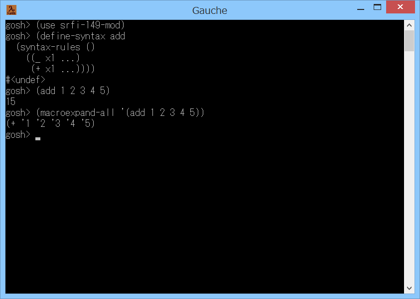

# srfi-149-mod



## 概要
- Gauche で SRFI-149 の参照実装の syntax-rules を使うためのモジュールです。  
  Gauche 用に一部改造しています。  
  また、現状、Gauche の本体も一部改造する必要があります。  
  このため、実行にはビルドのための開発環境も必要です。

- (注意) Gauche には組み込みの syntax-rules が存在するため、  
  通常は、本モジュールを使用する必要はありません。  
  マクロのテストや展開結果の比較のために利用することを想定しています。


## 変更点
- 主な変更点を以下に示します。  
  (本改造にあたっては、Sagittarius Scheme v0.8.4 のソースのコメントを参考にしました)

1. Gauche と仕様が異なる手続きの対応
   - identifier?
   - identifier->symbol
   - any

2. Gauche に存在しない手続きの対応
   - length*
   - cons-source
   - %number->string
   - strip-syntactic-closures

3. Gauche に存在しない構文の対応
   - syntax-quote


## インストール方法
1. 事前準備  
   事前に、Gauche のインストール、開発環境のインストール、  
   Gacuhe の開発最新版のソースの取得が必要になります。  
   Windows の場合には、以下のページを参照して、  
   「3. Gauche のソースのダウンロード」までを実施ください。  
   https://gist.github.com/Hamayama/6666e5d2c8d5167d22f7

2. 本サイトのソースのダウンロード  
   本サイト( https://github.com/Hamayama/srfi-149-mod )のファイルを、  
   (Download Zip ボタン等で)ダウンロードして、適当なフォルダに展開してください。

3. Gauche の改造  
   compile_add.scm の内容を、  
   Gauche のソースの src フォルダにある compile.scm の末尾に追加してください。  
   また、compile-1_add.scm の内容を、  
   Gauche のソースの src フォルダにある compile-1.scm の末尾に追加してください。

4. Gauche のビルド  
   Gauche のビルドを行ってください。  
   Windows の場合には、以下のページを参照して、  
   「5. Gauche のコンパイル」以後を実施ください。  
   https://gist.github.com/Hamayama/6666e5d2c8d5167d22f7

5. srfi-149-mod.scm のコピー  
   srfi-149-mod.scm を Gauche でロード可能なフォルダにコピーしてください。  
   (例えば (gauche-site-library-directory) で表示されるフォルダ等)

- 以上です。


## 使い方
Gauche を起動して、以下を実行すると、  
本モジュールの syntax-rules が使用可能になります。
```
(use srfi-149-mod)
```
例として、足し算を行うマクロを定義してみます。
```
(define-syntax add
  (syntax-rules ()
    ((_ x1 ...)
     (+ x1 ...))))
```
実行してみます。
```
(add 1 2 3 4 5)
; => 15
```
macroexpand-all で展開してみます。
```
(macroexpand-all '(add 1 2 3 4 5))
; => (+ '1 '2 '3 '4 '5)
```


## その他、注意事項等
1. Gauche には組み込みの syntax-rules が存在するため、  
   通常は、本モジュールを使用する必要はありません。  
   マクロのテストや展開結果の比較のために利用することを想定しています。

2. Gauche の将来のバージョンアップにより、動作しなくなる可能性があります。

3. REPL上で syntax-rules が組み込みのものか、本モジュールのものかを知りたい場合には、  
   REPL上で syntax-rules と入力してください。  
   組み込みであれば `#<syntax syntax-rules>` と表示されます。  
   本モジュールのものであれば `#<macro syntax-rules>` と表示されます。

4. 本モジュールをロードした状態で、Gauche のプリコンパイル (precomp) を実行すると、  
   本モジュールに依存したプリコンパイルデータができてしまいます。  
   基本的に、本モジュールをロードした状態で、プリコンパイルを行わないでください。


## 環境等
- OS
  - Windows 8.1 (64bit)
- 環境
  - MSYS2/MinGW-w64 (64bit/32bit) (gcc version 7.1.0 (Rev2, Built by MSYS2 project))
- 言語
  - Gauche v0.9.6_pre4

## 履歴
- 2017-12-11  v1.00 (初版)


(2017-12-11)
